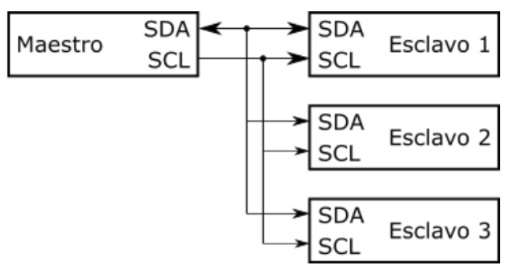
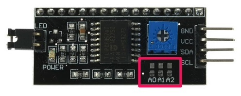
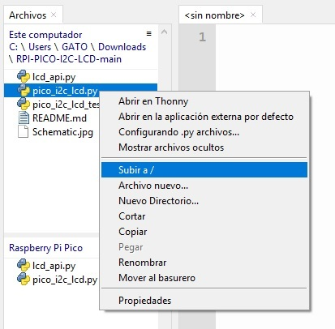
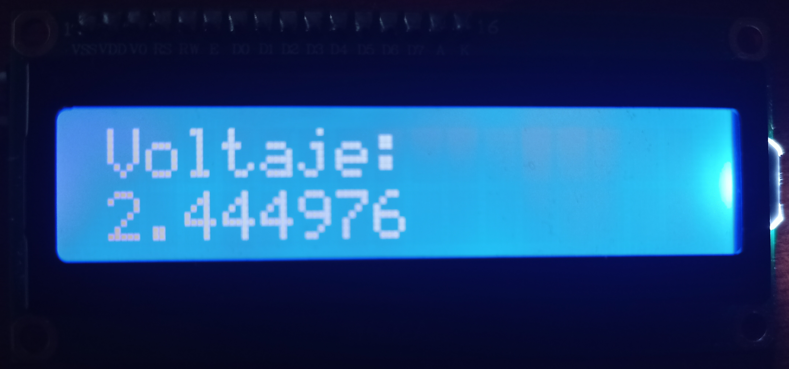

# Clase N°4: Interacción con el hardware - Parte III: I2C

  
*Figura 01 - Presentación Clase N°4*

En nuestros proyectos anteriores, si queríamos leer datos, confiábamos en el shell de Thonny, valiéndonos de nuestro monitor como medio de visualización. Sin embargo, en algunos proyectos, no siempre vamos a tener acceso a ambos. Si esto ocurre, vamos a precisar de algún otro hardware electrónico para completar este trabajo, y una variedad de dispositivos de visualización son útiles para esta tarea, cómo las pantallas *LCD*, *LED*, *OLED*, etc., que nos permiten transmitir información al usuario. 

Cada una de ellas tienen sus características como dispositivos de visualización, y pueden usarse en diferentes campos y aplicaciones según nuestros requerimientos. En la clase de hoy, aprenderemos específicamente cómo usar las pantallas o displays *LCD* (del inglés, *Liquid-Crystal Display*) para realizar la visualización de datos.

Para poder hacer esto, utilizaremos uno de los **protocolos de comunicación** más populares: **I2C** (del ingles, *Inter-Integrated Circuit*) que nos permitirá visualizar los datos en nuestra pantalla *LCD* .

¡Empecemos!

## 4.1 I2C (Inter-Integrated Circuit): definición, descripción de las señales e implementación en nuestra Raspberry Pi Pico.

Cuando realizamos la conexión de periféricos a nuestra computadora, sabemos que cada uno de ellos puede comunicarse con nuestro equipo gracias a un **protocolo de comunicación** estandarizado, siendo *USB* y *Ethernet* los más populares, entre muchos otros que existen actualmente. 

En el mundo de la electrónica digital sucede algo similar; muchas veces, si queremos vincular nuestro microcontrolador con otros periféricos, debemos valernos de un **protocolo de comunicación**. De todos los que existen, **UART (Universal Asynchronous Receiver-Transmitter)**, **SPI (Serial Peripheral Interface)** e **I2C (Inter-Integrated Circuit)** son los más conocidos, y todos ellos son implementables con nuestra *RPico*. Si bien las características particulares de cada uno son sencillas, en el curso nos detendremos en **I2C** por una razón fundamental: es el más utilizado en el campo del *Internet de las Cosas*  (*IoT*, *Internet of Things*). 

Además de los displays, existen una gran variedad de dispósitivos que cuentan con conexión **I2C**, como el *módulo sensor de intensidad lumínica BH1750* , el *módulo sensor de presión barométrica BMP180*, entre otros. Como mencionamos a lo largo del curso, siempre debemos prestar atención a la hoja de datos del dispositivo que conectemos a nuestra *RPico*.

El protocolo **I2C** (a veces también denominado **"Bus I2C"** o **"estándar I2C"**), fue desarrollado por Phillips Semiconductors (hoy NXP Semiconductors) en la década de los 80s. En un inicio se creó para poder comunicar varios chips al mismo tiempo dentro de los televisores que fabricaba la compañía. Sin embargo, con el paso del tiempo, otros fabricantes comenzaron a adoptarlo hasta convertirse en el estándar que es hoy para conectar múltiples circuitos integrados digitales.

**I2C** funciona con una arquitectura *maestro-esclavo* (master-slave). En esta, existen dos tipos de dispositivos:

1. *Maestro* (Master) o *Controlador* (Controller): son los que inician y coordinan la comunicación. En nuestro caso, la *RPico*.
2. *Esclavos* (Slave) o *Periféricos* (Peripheral): son los dispositivos que están a la espera de que algún *maestro* se comunique con ellos. Esto puede incluir a los displays, algunos sensores y actuadores, memorias, e incluso tambíen es posible, que un microcontrolador se comporte como un *esclavo*.

Sólo requiere de dos líneas de señal para su funcionamiento (Figura 02); *SCL* y *SDA*, y una línea de tierra o *GND*. Como la comunicación se realiza entre circuitos que comparten una misma línea de *GND*, por lo general esta línea es omitida en los esquemas de conexión. El **bus I2C** es serie (todos los datos van por una misma señal uno atrás del otro) y sincrónico (una de las señales se usa para sincronizar y marcar el tiempo). *SCL* (a veces también denominada *SCK*) es la señal de reloj y *SDA* es la señal de datos. 

  
*Figura 02 - Arquitectura I2C*

Es un protocolo bastante robusto y se puede usar con tramos cortos de cable de hasta 3 metros. Como desventajas, podemos mencionar que su funcionamiento es un poco más complejo (comparándolo con otros protocolos existentes); como así también la electrónica necesaria para implementarlo.

Para que la comunicación funcione de forma correcta se deben utilizar *resistencias PULL_UP* (resistencias conectadas a una tensión positiva), para asegurar un nivel alto cuando NO hay dispositivos conectados al **bus I2C**.

En la *RPico* no es necesario instalar estas resistencias cuando utilicemos este bus, ya que se activan de forma interna (de forma similar a lo que sucedía cuando implementábamos entradas digitales en la clase 2).

  
*Figura 03 - Esquema Eléctrico Bus I2C*

En el bus, cada dispositivo cuenta con una dirección, que se emplea para acceder a los dispositivos de forma individual. Esta dirección puede ser fijada por hardware (frecuentemente, mediante jumpers o interruptores) o totalmente por software.

En general, cada dispositivo conectado al bus debe tener una dirección única. Si tenemos varios dispositivos similares tendremos que cambiar la dirección o, en caso de no ser posible, implementar un bus secundario. El estándar actual de **I2C** permite acceder hasta un total de 112 dispositivos en un mismo bus, con una velocidad estándar de transmisión es de 100[kHz],con un modo de alta velocidad de 400[kHz].

Para la implementación de este protocolo debemos utilizar los pines específicos que se muestran en la Figura 04. Como mencionamos, solo utilizaremos dos cables; uno para el canal de clock (SCL) y otro para el canal de datos (SDA). La *RPico* posee dos buses **I2C** (I2C0 e I2C1), y pueden usarse uno o ambos, y son varios los pines físicos disponibles para ello.

  
*Figura 04 - Pines I2C de la RPico*

## 4.2 Display LCD 1602 con módulo I2C: funcionamiento, características y conexión.

Para demostrar el funcionamiento del **protocolo I2C**, utilizaremos un display LCD como el que se muestra Figura 05. Como mencionamos en la Clase N°1, este permite visualizar 16 caracteres alfanuméricos por  renglón (en este caso, en los dos que dispone), de allí la denominación display LCD1602.

  
*Figura 05 - Display LCD 1602 Con Modulo I2C*

Las pantallas LCD son unas de las formas más sencillas y económicas de dotar a nuestro proyecto de un medio de visualización de datos. El modelo que utilizaremos está basado en el controlador *Hitachi HD44780*, uno de los más utilizados debido a su sencillez y bajo precio. Si consultamos su hoja de datos [Hitachi HD44780 Datasheet](https://www.sparkfun.com/datasheets/LCD/HD44780.pdf), encontraremos que está diseñado para controlar *LCDs* monocromos de hasta 80 caracteres alfanuméricos y símbolos. También dispone de una pequeña memoria RAM para configurar nuestros propios caracteres o dibujos.

Realizar la conexión de este display de forma directa a un microcontrolador u otro dispositivo (Figura 06), conlleva el uso de una gran cantidad de cables, debido a que el envío de los distintos caracteres implica la utilización de al menos cuatro cables, más los cables necesarios para el control del disply (alimentación, control y habilitación).

  
*Figura 06 - Conexión directa Display 1602*

Como vemos, usar esta pantalla de forma directa requiere emplear una gran cantidad de pines de nuestra *RPICO* (además de una gran cantidad de código), lo que supone un enorme desperdicio de recursos. Una alternativa recomendable es usar un módulo que permita acceder al LCD a través del **bus I2C**. Si giramos nuestro display, observaremos este módulo incorporado y soldado a nuestra placa. Puntualmente, el módulo que utiliza es el **PCF8574**.

  
*Figura 07 - Módulo PCF8574*

Este módulo **LCD-I2C** [PCF8574 Datasheet](https://www.ti.com/lit/ds/symlink/pcf8574.pdf) puede conectarse a cualquier LCD basado en el *Controlador Hitachi HD44780* y reduce la cantidad de cables necesarios a dos. Podemos adquirirlo de forma conjunta con el LCD, como así también de forma individual. 

La conexión es sencilla, simplemente alimentamos el módulo desde nuestra *RPico* mediante *GND* y *VBUS*, y conectamos el pin SDA y SCL de la *RPico* con los pines correspondientes del PCF8574.

  
*Figura 08 - Esquema Conexión Módulo PCF8574*

## 4.3 Descubriendo la dirección I2C de nuestro display LCD

Como mencionamos anteriormente, cada componente que conectamos al **bus I2C** tiene una dirección única, y cada mensaje y orden que transmitimos al bus, lleva anexa esta dirección, indicando cuál de los muchos posibles, es el receptor del mensaje.

Pero, claro, esto implica que sabemos de antemano la dirección del componente. El procedimiento normal es ir a la hoja de datos del dispositivo que deseamos conectar y allí encontrar la información que precisamos. Por ejemplo, el *módulo sensor de intensidad lumínica BH1750* que mencionamos anteriormente, en su hoja de datos [BH1750 Datasheet](https://datasheet.octopart.com/BH1750FVI-TR-Rohm-datasheet-25365051.pdf) nos indica que es posible configurarle dos direcciones para el bus **I2C**; *0x23* (0100011 en binario) o *0x5C* (1011100 en binario) , en función de la tensión que le ingresemos a un pin que posee para este propósito (*ADDR*).  

Pero como suele pasarnos en muchos otros aspectos de la vida, muy frecuentemente no disponemos de esta información, y debemos valernos de otro medio para obtenerla. Afortunadamente **MicroPython** tiene una solución para esto.

Tomemos nuestro display LCD1602 como dispositivo del cual queremos conocer su dirección **I2C**, y lo conectamos como se muestra en la Figura 09 con la ayuda de cables Dupont Macho-Hembra (M2F).

  
*Figura 09 - Conexión display LCD1602 a RPico*

Como se observa, conectaremos el pin *VCC* del display al pin *VBUS* (cable color rojo), de forma que se alimente con 5[Voltios]. Además el pin *GND* debe conectarse a un pin homónimo de la *RPico* (en la conexión de la Figura 09, se escogió el pin físico 38).

En este caso, y haciendo referencia a la Figura 04, escogimos los pines *I2C0 SDA* (pin físico 1) e *I2C0 SCL* (pin físico 2) de la *RPico* para conectarlos a los correspondientes *SDA* y *SCL* del display.

Comencemos por conectar la *RPico* a nuestra computadora. Y ya apreciarás que el display enciende su *backlight* (azul, verde o el color correspondiente al modelo).  

Luego ejecutemos *Thonny*, y en el área de Script carguemos las librerías habituales, incorporando ahora la función *I2C*:

```python
from machine import Pin, I2C
from utime import sleep
```

A continuación, haremos las siguientes definiciones:

```python
scl = Pin(1)
sda = Pin(0)
freq = 400000
```
Esto nos permite especificar los pines que utilizaremos para la comunicación, recordando que solo precisamos de dos señales en el **protocolo I2C**. Y por último establecemos velocidad de transmisión, en este caso, en su máximo posible de 400[kHz] (400000 [Hz]).

Y luego construimos el objeto *i2c* de la siguiente manera:

```python
i2c = I2C(0,sda=sda,scl=scl,freq=freq)
```

El primer argumento indica el bus **I2C** de la *RPico* que utilizaremos, recordemos que cuenta con dos; *I2C0* e *I2C1*. El segundo y tercer argumento deben ser un objeto pin, que especifique cual de ellos se utilizara para *SCL* (GP1) y *SDA* (GP0) respectivamente. Y el cuarto argumento, debe ser un número entero que establezca la velocidad máxima para SCL.

Por último, nos valdremos del método *scan()* que escanea todas las direcciones **I2C** en el bus especificado cuando creamos el objeto, entre las direcciones 0x00 y 0x77, es decir un total de 120 direcciones. Recordemos que el estándar actual de **I2C** nos permite direccionar hasta un total de 112 dispositivos en un mismo bus.

Cada uno de los dispositivos que encuentre en el bus, los listará en un arreglo. Como solo hemos conectado un dispositivo **I2C**, vamos a obtener la dirección correspondiente en hexadecimal de la siguiente manera:

```python
direccion = hex(i2c.scan()[0])
```

Y finalmente imprimimos el valor obtenido:

```python
print('La dirección I2C es:', direccion)
```

Ejecutamos el código (ver *Ejemplo12_ObtenerDirecciónI2C.py* en el repositorio) y observaremos el valor **0x27** en nuestra consola, ¡es la dirección **I2C** de nuestro display!

Para comprobar esto, podemos dirigirnos a la hoja de datos del **PCF8574**. Allí veremos que el módulo dispone de 3 pads (A0, A1 y A2), con los cuales se selecciona la dirección **I2C**. Cuando ninguno está puenteado (como en nuestro caso), la dirección es **0x27** (en binario, 00100111). 

  
*Figura 10 - Pads del PCF8574*

Estos pads seleccionan los 3 últimos dígitos binarios de la dirección. Al estar en circuito abierto, el dígito es '1'. Al estar puenteado, es '0'. Por ejemplo, si puenteamos A0 y A1, la dirección pasaría a ser '00100100' o **0x24**.

Con esto, comprobamos que el reconocimiento de la dirección **I2C** fue correcto. 

## 4.4 Instalación de librerías en Thonny

Hasta el momento hemos empleado librerías estándar de **MicroPython**, puntualmente *machine* y *utime*. Pero también existen aquellas librerías que han sido desarrolladas por los usuarios y la comunidad en general, que nos proporcionan funciones muy útiles para poder llevar a cabo nuestros proyectos. En la clase de hoy, utilizaremos una de ellas para controlar nuestro *display LCD 1602 con módulo I2C*. 

Primero debemos dirigirnos al siguiente repositorio [RPI-PICO-I2C-LCD](https://github.com/T-622/RPI-PICO-I2C-LCD), y luego descargarla como se muestra en la Figura 11, haciendo clic en *Code* y luego en *Download ZIP*.

  
*Figura 11 - Descarga librería RPI-PICO-I2C-LCD*

Una vez descargada y descomprimida la librería, encontrarás cinco archivos y tres de ellos con extensión *".py"*. Para que funcione la librería, debes pasar los archivos *lcd_api.py* y *pico_i2c_lcd.py* a la memoria de la *RPico*. Esto lo podemos hacer desde *Thonny* con nuestra *RPico* conectada.

Para ello, nos dirigimos a *Visualización* y luego a *Archivos*. En el panel que se abrirá a la izquierda de nuestra pantalla, buscamos la dirección donde están los archivos descargados.

Una vez allí, hacemos click derecho en *lcd_api.py* y seleccionamos *Subir a/*, de forma tal que este archivo pase a la memoria de nuestra *RPico*. Luego repetimos lo mismo con el archivo *pico_i2c_lcd.py* (Figura 12).

  
*Figura 12 - Cargar archivos de librería en la RPico*

Si esto fue realizado de forma correcta, debemos encontrar estos dos archivos en la pestaña inferior *Raspberry Pi Pico* como se muestra en la Figura 12.

Esto indica que los archivos se encuentran dentro de la memoria flash de la *RPico* y que ya podemos utilizarlos.

Para invocar las clases correspondientes de cada una de estas librerías, debemos importarlas de la siguiente manera:

```python
from lcd_api import LcdApi
from pico_i2c_lcd import I2cLcd
```

## 4.5 Funciones de la librería RPI-PICO-I2C-LCD

Para comenzar a utilizar las funciones, primero debemos definir el **bus I2C** que utilizaremos de nuestra *RPico*. Para ello, repetimos lo hecho anteriormente para el circuito de la Figura 09.

```python
scl = Pin(1)
sda = Pin(0)
freq = 400000

i2c = I2C(0,sda=sda,scl=scl,freq=freq)
```

Y luego debemos definir el objeto *lcd* para poder comandar nuestro display. Esto se realiza de la siguiente manera:

```python
lcd = I2cLcd(i2c, I2C_ADDR, I2C_NUM_ROWS, I2C_NUM_COLS)
```

Donde vemos que el primer argumento contiene todas las características del **bus I2C** implementado. El segundo argumento contiene la dirección del display a comandar, que ya la obtuvimos previamente y es *0x27*. Y por último, el tercer y cuarto argumento contiene el número de filas y columnas de nuestro display, en nuestro caso, 2 y 16 respectivamente. 

Con esta información, la definición correcta de nuestro display sería la siguiente:

```python
I2C_ADDR = 0x27
I2C_NUM_ROWS = 2
I2C_NUM_COLS = 16

lcd = I2cLcd(i2c, I2C_ADDR, I2C_NUM_ROWS, I2C_NUM_COLS)
```
La documentación completa de todas las funciones que posee esta librería se encuentra en el archivo *README.md* que se aprecia en la Figura 12. De igual manera, un resumen de aquellas que utilizaremos se da a continuación. 

1. *lcd.putstr("Texto")*: Envía una cadena de caracteres al display. Para imprimir una variable debes usar la instrucción *lcd.putstr(str (variable))*, que convierte la variable en una cadena.

2. *lcd.show_cursor()* / *lcd.hide_cursor()*: Mostrar / Ocultar el cursor del display.

3. *lcd.blink_cursor_on()* / *lcd.blink_cursor_off()*: Enciende / Apaga el cursor parpadeante al imprimir.

4. *lcd.backlight_on()* / *lcd.backlight_off()*: Enciende / Apaga la luz de fondo del display.

5. *lcd.display_on()* / *lcd.display_off()*: Enciende / Apaga el display (no el backlight, sino todo el chip).

6. *lcd.clear()*: Borra todos los caracteres o cualquier cosa escrita en el display.

7. *lcd.move_to(Col, Row)*: Mover a la posición indicada en *Col* y *Row*, respetando siempre los límites establecidos en *I2C_NUM_ROWS* e *I2C_NUM_COLS*. 

A esta altura ya debes estar ansioso por imprimir tu primer ¡Hola Mundo!, así vayamos a ello. Continuaremos utilizando las conexiones del circuito de la Figura 09.

Como siempre, arrancamos por conectar la *RPico*, ejecutar *Thonny* y hacer clic en el área de Script para cargar las librerías habituales, incorporando ahora todas las definiciones que hicimos hasta el momento que corresponden al **bus I2C** y al display LCD:

```python
from machine import Pin, I2C
from utime import sleep
from lcd_api import LcdApi
from pico_i2c_lcd import I2cLcd

scl = Pin(1)
sda = Pin(0)
freq = 400000

i2c = I2C(0,sda=sda,scl=scl,freq=freq)

I2C_ADDR = 0x27
I2C_NUM_ROWS = 2
I2C_NUM_COLS = 16

lcd = I2cLcd(i2c, I2C_ADDR, I2C_NUM_ROWS, I2C_NUM_COLS)
```
Y ahora, debemos agregar un bucle que permita escribir de forma continua en nuestro display. Esto se logra de la siguiente manera:

```python
while True:
    lcd.clear() # Borra cualquier caracter previo que exista
    lcd.move_to(0,0) # Posiciona el cursor en el primer renglón y en la primera columna
    lcd.putstr("Hola Mundo!") # Escribir en la pantalla
    sleep(5)
```

Cuando ejecutes el código (ver *Ejemplo13_HolaMundoDisplayLCD* en el repositorio), verás un mensaje como el de la Figura 13.

  
*Figura 13 - Hola Mundo en el display LCD*

## 4.6 Visualizando datos
 
Por supuesto, no sirve de mucho una pantalla que solo dice Hola Mundo!. Para ver el potencial de esto, recorramos alguno de los ejemplos realizados durante el curso. 

Tomemos el Ejemplo N°9 de la Clase N°3, donde realizamos la lectura del sensor de temperatura interno de nuestra *RPico*, e incorporemos el display de la misma forma que en el circuito de la Figura 09. Al código debemos sumarle ahora, todo lo referido a **I2C** y al display, quedando de la siguiente manera (Ver *Ejemplo14_LecturayVisualizaciónTemperaturaRP2040* en el repositorio):

```python
from machine import Pin, ADC, I2C
from utime import sleep
from lcd_api import LcdApi
from pico_i2c_lcd import I2cLcd

sensor_temp = ADC(4)

factor_conversion = 3.3 / (65535)

scl = Pin(1)
sda = Pin(0)
freq = 400000

i2c = I2C(0,sda=sda,scl=scl,freq=freq)

I2C_ADDR = 0x27
I2C_NUM_ROWS = 2
I2C_NUM_COLS = 16

lcd = I2cLcd(i2c,I2C_ADDR,I2C_NUM_ROWS,I2C_NUM_COLS)

while True:
    lectura = sensor_temp.read_u16() * factor_conversion
    temperatura = 27 - (lectura - 0.706)/0.001721
    
    lcd.clear() # Borra cualquier caracter previo que exista
    lcd.move_to(0,0) # Posiciona el cursor en el primer renglón y en la primera columna
    lcd.putstr("Temperatura: ") # Escribir en la pantalla
    lcd.move_to(0,1) # Posiciona el cursor en el segundo renglón y en la primera columna
    lcd.putstr(str (temperatura)) # Escribir en la pantalla
    sleep(5)
```

Ejecuta el código y visualizarás la temperatura de tu *RP2040* como se aprecia en la Figura 14.

  
*Figura 14 - Visualización Temperatura RP2040*

Tengamos en cuenta que en el ejemplo anterior estamos actualizando la lectura del sensor cada 5 segundos. Algunas aplicaciones requieren un tiempo menor, para que exista una correspondencia casi inmediata entre la variable que estamos monitoreando, y su visualización en el display. 

Un caso práctico de esto sería la lectura de un potenciómetro como el del Ejemplo N°8 de la Clase N°3. Repite la conexión realizada e incorpora ahora el display de la misma forma que en el circuito de la Figura 09.

En cuanto al código, nuevamente debemos sumarle todo lo referido a **I2C** y al display, quedando de la siguiente manera (Ver *Ejemplo15_LecturayVisualizaciónPotenciómetro* en el repositorio):

```python
from machine import Pin, ADC, I2C
from utime import sleep
from lcd_api import LcdApi
from pico_i2c_lcd import I2cLcd

potenciometro = ADC(26)

factor_conversion = 3.3 / (65535)

scl = Pin(1)
sda = Pin(0)
freq = 400000

i2c = I2C(0,sda=sda,scl=scl,freq=freq)

I2C_ADDR = 0x27
I2C_NUM_ROWS = 2
I2C_NUM_COLS = 16

lcd = I2cLcd(i2c,I2C_ADDR,I2C_NUM_ROWS,I2C_NUM_COLS)

while True:
    voltaje = potenciometro.read_u16() * factor_conversion

    lcd.clear() # Borra cualquier caracter previo que exista
    lcd.move_to(0,0) # Posiciona el cursor en el primer renglón y en la primera columna
    lcd.putstr("Voltaje: ") # Escribir en la pantalla
    lcd.move_to(0,1) # Posiciona el cursor en el segundo renglón y en la primera columna
    lcd.putstr(str (voltaje)) # Escribir en la pantalla
    sleep(1)
```

Ejecuta el código y gira la perrilla del potenciómetro completamente en una dirección y luego completamente en la otra. Observarás los valores que antes imprimías en en el área de Shell, pero ahora en tu display LCD como se aprecia en la Figura 15.

  
*Figura 15 - Visualización de los valores de un potenciómetro*

¡Felicitaciones! Has aprendido los principales conceptos acerca de **I2C** y su aplicación para visualizar datos en un display LCD